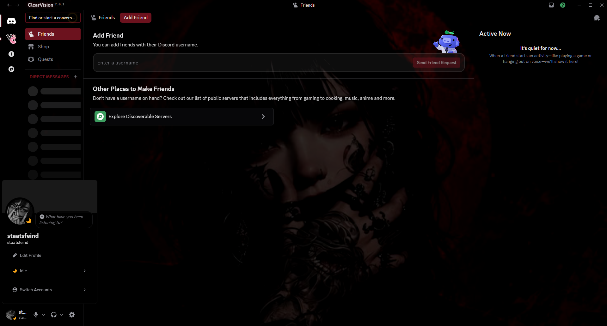
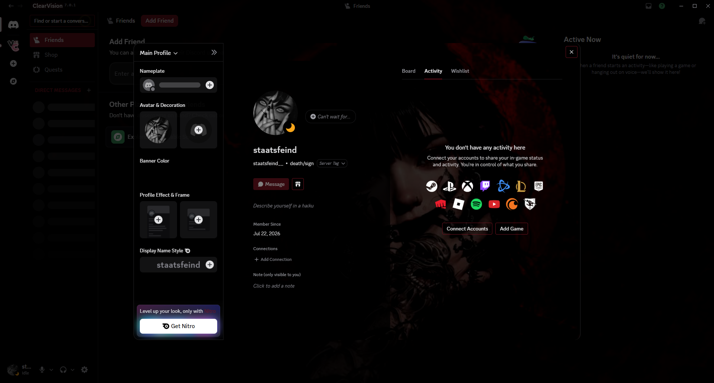
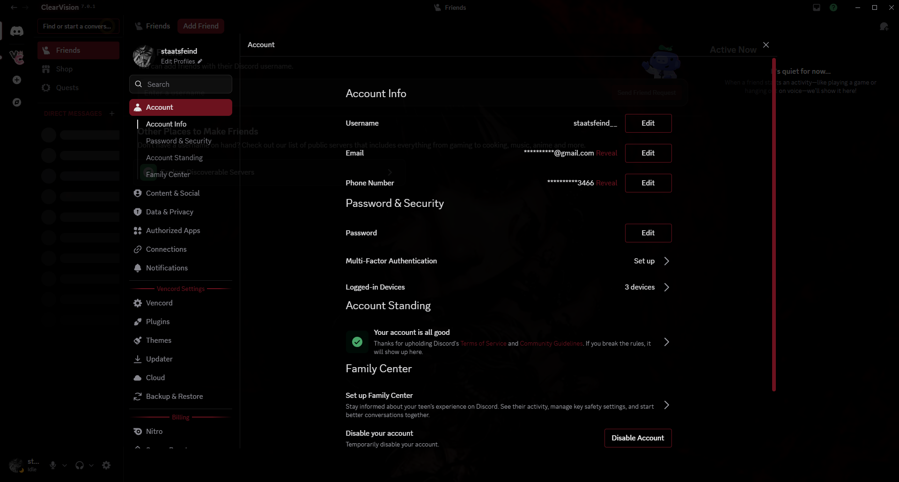

# Exiqon ClearVision: Crimson Dominion

A custom **ClearVision v7** variant featuring a crimson color palette, cinematic wallpaper, refined transparency, and subtle UI improvements.

---

## Preview

### Home

  

### Profile

  

### Settings

  

---

## Features

- Crimson Dominion color palette
- Cinematic wallpaper
- Refined transparency
- Cleaner UI
- Custom accent colors
- BetterDiscord & Vencord compatible

---

## Installation

1. Install **BetterDiscord** or **Vencord**
2. Download `Exiqon-ClearVision-CrimsonDominion.theme.css`
3. Move it into your Themes folder
4. Enable the theme

---

## Credits

This theme is based on the excellent **ClearVision v7** project.

All credit for the original base theme goes to the **ClearVision Team**.

Original project:
- https://github.com/ClearVision/ClearVision-v7
- https://clearvision.github.io

This repository only contains my personal visual modifications.

---

## Disclaimer

This is an unofficial customization of **ClearVision v7** and is not affiliated with or endorsed by the ClearVision Team.
